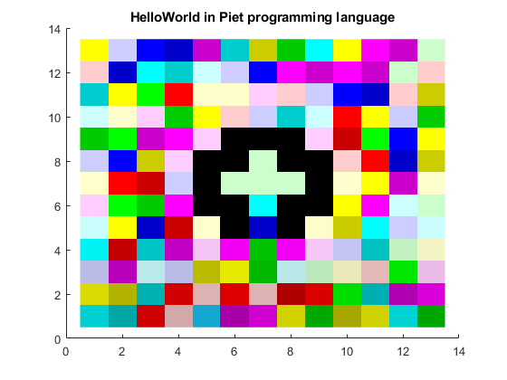

# Hello World Piet - MATLAB Script

*MATLAB script that reproduce a Piet 'Hello World' program*

## Output:
The output of the program is an image that can be used as '*code*' for Piet. The output image will be the following:

